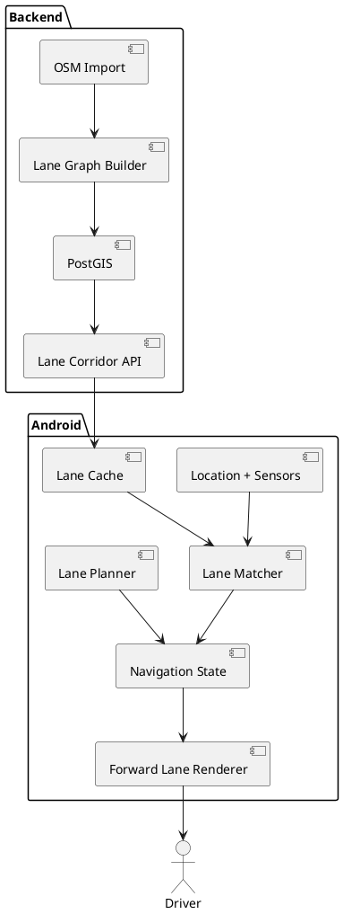

# SPEC-001-Lane-Level GPS

## Background

Conventional navigation usually gives road-level guidance and may show static
lane arrows only shortly before a junction. This system gives drivers an early,
live, forward-looking lane-level view before complex intersections, merges,
lane changes, and exits.

The Android-first MVP uses smartphone GNSS/GPS and motion sensors only. It
represents uncertainty explicitly rather than promising exact lane detection
where the phone cannot support it.

## Requirements

### Must

- Android smartphone positioning.
- OpenStreetMap-derived lane graph.
- Probabilistic lane estimation and confidence-aware UI.
- Early multi-step lane planning.
- Forward-looking lane visualization.
- Complex junction/merge/exit handling where map data permits.
- Recalculation and offline corridor caching.
- Integration with normal destination routing.

### Should

- Sensor fusion.
- Adaptive warning distance.
- Lane-change progression detection.
- Voice guidance.
- Drive recording and replay.

### Could

- Android Auto / CarPlay.
- Crowdsourced lane corrections.
- Camera AR.
- ML-assisted localization.

### Won't in MVP

- CAN-bus integration.
- Camera lane detection.
- Guaranteed exact-lane identification.
- Autonomous vehicle control.

## Method

The matcher evaluates lane-centerline distance, heading, active-route
preference, previous state, legal reachability, and source-map confidence. It
returns a probability distribution rather than a categorical answer.

The planner uses weighted shortest-path search over lane connectivity and adds
cost to unnecessary lane changes. Planning is performed early enough that the
driver can reach a valid downstream lane before the decision zone.

## Implementation

1. Android shell and pure Kotlin lane engine.
2. PostGIS schema and lane-corridor API.
3. OSM lane-tag normalization.
4. Region-specific PBF importer and lane-centerline generator.
5. Self-hosted OSM road routing.
6. Active-route corridor cache on Android.
7. Live precise-location and motion-sensor source.
8. Forward lane renderer and voice guidance.
9. Field drive recorder and ground-truth UI.
10. Replay/calibration loop.

## Milestones

M1 repository + Android shell; M2 OSM lane pipeline; M3 road routing + lane
guidance; M4 live lane estimation; M5 forward visualization; M6 drive replay;
M7 field calibration; M8 controlled MVP release.

M4 + M6 are the first go/no-go gate for smartphone-only exact-lane inference.

## Gathering Results

Technical accuracy and driver outcomes carry equal weight.

Initial technical targets:

- >=90% correct lane among high-confidence claims.
- <5% false lane-change detection.
- >=98% correct road-segment matching.
- <5 seconds recovery after transient positioning error.
- <3% incorrect high-confidence lane claims.

A/B tests compare conventional navigation against lane-level guidance on
unfamiliar complex routes. Measure missed exits, wrong turns, late lane
changes, reroutes, time in a valid lane before the decision zone, and glance
comprehension.

## Need Professional Help in Developing Your Architecture?

Please contact me at [sammuti.com](https://sammuti.com) :)
